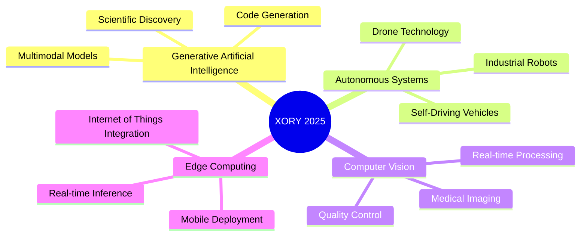

# <div align="center">🚀 **XORY** 🚀</div>

<div align="center">
  


### *Pioneering the Future Through Artificial Intelligence & Robotics*

**🌟 Where Cutting-Edge AI Meets Revolutionary Robotics 🌟**

---

</div>

## 🎯 **Our Mission**

We are a **next-generation consortium** of for-profit and nonprofit organizations at the forefront of **artificial intelligence** and **robotics innovation**. Our mission: to develop **transformative AI solutions** that serve humanity while pushing the boundaries of what's technologically possible.

**💡 Vision**: *To be the catalyst for the next AI-robotics revolution*

---

## 🧠 **What We Do**

<table>
<tr>
<td width="50%">

### 🤖 **Artificial Intelligence & Computer Vision**
- **Object Detection** & **Image Recognition Systems**
- **Video Processing** & **Real-time Streaming Analysis**
- **Facial Recognition** & **Gesture Recognition Technology**
- **Medical Image Analysis** & **Satellite Image Processing**
- **Augmented Reality** & **Virtual Reality Applications**

</td>
<td width="50%">

### 🦾 **Autonomous & Mobile Robotics**
- **Self-Driving Vehicles** & **Navigation Systems**
- **Drone Technology** & **Unmanned Aerial Systems**
- **Warehouse Automation** & **Delivery Robots**
- **Smart Home Assistants** & **Service Robots**
- **Industrial Assembly** & **Quality Control Systems**

</td>
</tr>
</table>

---

## 🔥 **Technology Stack**

<details>
<summary><b>🚀 Core Languages & Frameworks</b></summary>

```
🐍 Python    🦀 Rust      ⚡ C++        📘 TypeScript   🐹 Go
🔮 Julia     🍎 Swift     🤖 Kotlin     🌐 JavaScript   💻 Bash
```

**Artificial Intelligence & Machine Learning Powerhouse**
```
PyTorch • TensorFlow • Computer Vision Libraries • OpenCV • YOLO Object Detection
Stable Diffusion • Deep Learning • Reinforcement Learning • Natural Language Processing
Scikit-learn • Keras • TensorBoard • Jupyter Notebooks • Google Colab
```

**🔍 Computer Vision & Image Processing**
```
OpenCV • PIL (Python Imaging) • Scikit-image • ImageIO • Matplotlib
YOLO (You Only Look Once) • R-CNN • Mask R-CNN • ResNet • VGG Networks
MediaPipe • Face Recognition • Optical Character Recognition
```

**📹 Video Processing & Analysis**
```
FFmpeg • OpenCV Video • MoviePy • VidGear • PyAV
Real-time Streaming • Motion Detection • Object Tracking
Video Compression • Frame Analysis • Live Broadcasting
```

</details>

<details>
<summary><b>☁️ Cloud-Native Infrastructure</b></summary>

**Multi-Cloud Excellence**
```
AWS (Lambda, Fargate, EKS, SageMaker) • GCP (Vertex AI, BigQuery, Cloud Run)
Azure (AKS, Cognitive Services) • Kubernetes • Docker • Helm • Istio
Envoy • Prometheus • Grafana • ArgoCD • Terraform • Pulumi • HashiCorp Vault
```

</details>

<details>
<summary><b>⚡ Data Engineering & Analytics</b></summary>

**Real-time Data Pipeline**
```
Apache Kafka • Apache Pulsar • Apache Flink • Apache Spark • Delta Lake
Snowflake • ClickHouse • TimescaleDB • Apache Druid • Apache Airflow
```

</details>

<details>
<summary><b>🤖 Robotics & Edge Computing</b></summary>

**🤖 Autonomous & Mobile Robotics Stack**
```
Robot Operating System 2 (ROS2) • NVIDIA Jetson • PX4 Flight Controller
Real-time Communication • Edge Computing • TinyML • Federated Learning
CUDA Programming • OpenCV Computer Vision • Point Cloud Processing
Path Planning • Obstacle Avoidance • Simultaneous Localization and Mapping
```

**🎯 Computer Vision & Image Analysis**
```
Image Classification • Object Detection • Semantic Segmentation
3D Vision Systems • Stereo Vision • Depth Estimation
Medical Imaging • Satellite Analysis • Quality Inspection
Real-time Processing • Edge Deployment • Mobile Vision
```

</details>

<details>
<summary><b>🔒 Security & Compliance</b></summary>

**Zero-Trust Architecture**
```
OPA (Open Policy Agent) • Sigstore • TUF • Prisma Cloud • Snyk
Aqua Security • Falco • SIEM • SOC2 • GDPR Compliance
```

</details>

<details>
<summary><b>🌐 Modern Web & Applications</b></summary>

**Full-Stack Excellence**
```
React • Next.js • Vue 3 • SvelteKit • Deno • FastAPI • Flask • Tauri
WebAssembly (WASM) • Progressive Web Apps (PWA)
```

</details>

---

## 🏆 **Elite Methodologies**

<div align="center">

| **Development** | **Operations** | **Artificial Intelligence** |
|:---:|:---:|:---:|
| Test-Driven Development | Machine Learning Operations | Model Training & Deployment |
| Code Review Standards | DevOps & Infrastructure | Computer Vision Pipelines |
| Domain-Driven Design | Site Reliability Engineering | Continuous Model Improvement |

</div>

---


## 🌟 **Why Join Xory?**

<table>
<tr>
<td width="33%">

### 🚀 **Cutting-Edge Innovation**
- Work with **state-of-the-art AI models**
- Pioneer **robotics breakthroughs**
- Shape the **future of technology**
- Access to **premium compute resources**

</td>
<td width="33%">

### 🌍 **Global Impact**
- **Humanitarian-focused** projects
- **Open-source contributions**
- **Research publications**
- **Conference presentations**

</td>
<td width="33%">

### 💼 **Elite Environment**
- **World-class talent** network
- **Flexible remote-first** culture
- **Competitive compensation**
- **Equity participation**

</td>
</tr>
</table>

---

## 📈 **Current Focus Areas**



---

## 🎯 **Talent We're Seeking**

<div align="center">

**🔥 HIGH-DEMAND ROLES 🔥**

| **Artificial Intelligence Engineers** | **Robotics Engineers** | **Platform Engineers** |
|:---:|:---:|:---:|
| Large Language Model Specialists | Controls Engineers | DevOps Engineers |
| Computer Vision Engineers | Perception Engineers | Cloud Architects |
| Natural Language Processing | Motion Planning Engineers | Security Engineers |
| Machine Learning Operations | Hardware Integration | Full-Stack Developers |

**💰 Competitive packages • 📈 Equity upside • 🌴 Unlimited PTO**

</div>

---

### **Learn More About Our Technologies**

[](https://opencv.org/)
[](https://www.ros.org/)
[](https://www.nvidia.com/en-us/autonomous-machines/)
[](https://ffmpeg.org/)

### **Our Ecosystem**

[](https://aicody.com/main/)
[](https://xory.us/main/)
[](https://aideo.us/main/)
[](https://aid.aideo.us/)

### **Connect With Us**

[](https://www.linkedin.com/company/aicody/about/)
[](https://www.linkedin.com/company/xoryus/about/)

### **Contact Us**

📧 **Email**: team@xory.us | team@aicody.com | team@aideo.us  
📍 **Address**: 5 Thomas Mellon Circle, Suite 154, San Francisco CA 94134 USA

</div>

</div>

---

<div align="center">

### *"The best way to predict the future is to invent it."*

**🌟 Star our repos if you believe in our mission! 🌟**


[](https://github.com/Xory-us)

---

**©️ 2025 Xory Consortium • Innovating Responsibly • Serving Humanity**

*Built with 💜 by the Xory Team*

</div>
